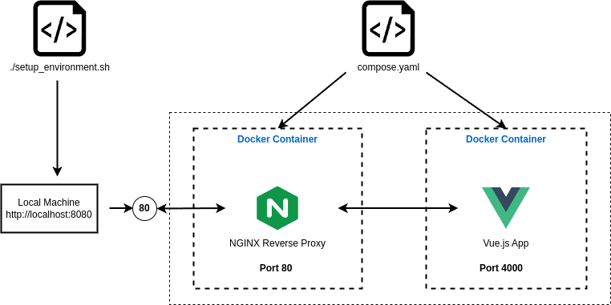

# Vue.js Dockerized Development Environment

This script automates the process of setting up a development environmentfor a Vue.js project using Docker and Docker Compose.
It handles the installation of the Docker, cloning of Vue.js repository, and the configuration of a Docker-based environment with Nginx as a reverse proxy.



## Prerequisities
- Ubuntu
- `sudo` privileges for installing packages and managing system services

## Script Details

### Variables
These variables define color codes for different output messages. Red for errors, blue for active commands, and green for successful results.
```
# color palette
green_prefix="\033[32m" # success
blue_prefix="\033[34m" # processing
red_prefix="\033[31m" # error
suffix="\033[00m" #suffix
```

### Functions
`install_docker()` funtion, installs Docker and enables and starts Docker services.

1. **Check if Docker installed**
   
   If Docker already installed, it skips the Docker installation. If not, then it runs the `install_docker()` function.
   ```
    # Check if docker already installed
    docker version > /dev/null 2>&1
    if [ $? -eq 0 ]; then
        echo -e "$green_prefix"Docker already installed."$suffix"
    else
        install_docker
    fi
    ```
2. **Creating project directories**

    ```
    # Create project directories
    mkdir -p ~/dev-env/
    mkdir -p ~/dev-env/nginx
    ```
  
3. **Check if Git installed**

    If Git already installed, it skips the Git installation. If not, then it installs Git.
    ```
    # Check if git already installed:
    git version > /dev/null 2>&1
    if [ $? != 0 ]; then
        sudo apt-get install -y git > /dev/null 2>&1
    fi
    ```

4. **Clone the Vue.js repository**

   ```
   # Clone Vue.js repository:
   cd ~/dev-env
   echo -e "$blue_prefix"Cloning project repository into ~/dev-env/v2.vuejs.org..."$suffix"
   git clone https://github.com/vuejs/v2.vuejs.org.git > /dev/null 2>&1
   echo -e "$green_prefix"Successful."$suffix"
   cd ..
   ```

5. **Create Dockerfiles and Nginx configurations**

    -  Creates a `Dockerfile` in `~/dev-env/v2.vuejs.org` to set up a Node.js environment for the Vue.js application.
    -  Creates a `Dockerfile` in `~/dev-env/nginx` to set up Nginx as a reverse proxy.
    -  Creates an Nginx configuration file named `nginx.conf` in `~/dev-env/nginx` to proxy requests to the Vue.js application.
    -  Creates a `compose.yaml` file in `~/dev-env` to define the multi-container Docker application.

6. **Start the development environment**

   Uses Docker Compose to build and start the containers in detached mode. Prints messages to indicate the setup is complete and provides instructions to access the application and code files.
    ```
    cd ~/dev-env
    docker-compose up -d
    ```
   Messages:
   ```
   echo "Development environment setup has been successfully completed."
   echo "App is running at http://localhost:8080"
   echo "You can access code files by changing directory into project directory by using: cd ~/dev-env/v2.vuejs.org"
   ```

## Usage

1. Open a termianl and clone this repository on your machine and `cd` into it:
   ```
   git clone https://github.com/rasimthegrey/dev-setup-script.git
   ```
2. Make the script executable:
   ```
   chmod +x setup_environment.sh
   ```
3. Run the script:
   ```
   ./setup_environment.sh
   ```

## Accessing the application
The application will be running at `http://localhost:8080`.

## Error Handling

The script logs erros to `errors.log`. If any step fails, refer to `errors.log` for details.
